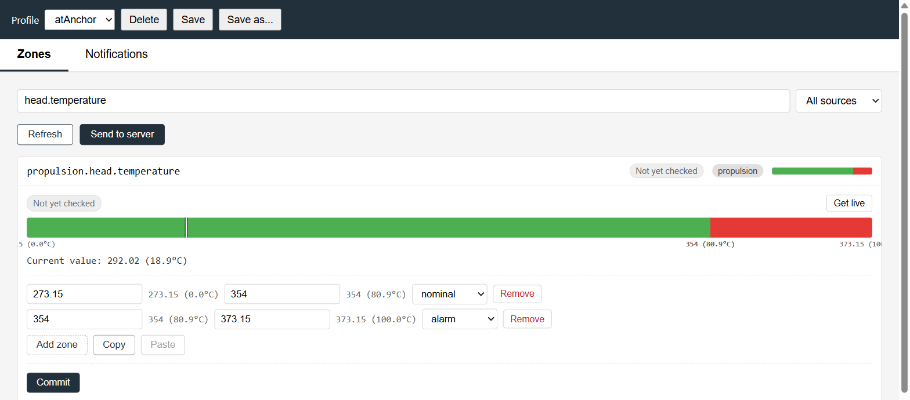
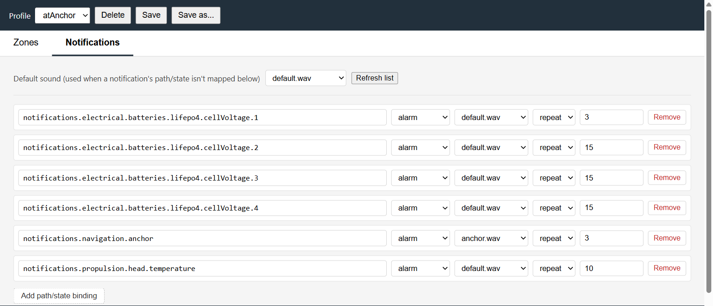

# signalk-alarms
# Apart from this line everything in this repo has been created by Claude pro/Claude code. 
A [Signal K](https://signalk.org/) plugin + webapp for threshold alarms and sound alerts,
with savable, switchable **profiles** so different situations (anchored, coastal, offshore)
can each have their own thresholds and sounds — swap between them in one click.

## Why this exists

OpenCPN's Watchdog plugin has had a broken "New Alarm" dialog since at least 2023
([rgleason/watchdog_pi#44](https://github.com/rgleason/watchdog_pi/issues/44)) — not
realistically fixable from outside the plugin itself. Meanwhile, general-purpose notification
players on this boat (`signalk-notification-player`, `openplotter-notifications`) turned out to
have real, sometimes serious bugs in their retry/repeat logic — see `CLAUDE.md`'s gotchas
section for specifics, including a runaway-retry incident that took a whole SignalK server
down.

This plugin unifies both jobs — zone thresholds *and* sound alerts — in one place, built
directly on top of what Signal K server already does well:

- **Signal K server's own core** does the actual threshold evaluation. This plugin doesn't
  reimplement that — it writes to `meta.zones` on any path, and core's native `Zones` watcher
  (already running in every Signal K server instance) evaluates it and fires real
  `notifications.<path>` deltas on crossing.
- **This plugin's own job** is the editor UI, the profiles concept (nothing off-the-shelf does
  this), and sound playback — mapping any `notifications.*` path/state to a pre-generated sound
  file, played with deliberate backoff on the failure path (the exact category of bug that bit
  the alternatives above).

## Screenshots

**Zones tab** — set thresholds on any numeric path, with a live value marker on the bar and
unit conversion (Kelvin → °C shown here) in the boundary labels, the live-typing hints, and the
current-value readout:



**Notifications tab** — map any `notifications.*` path + state to a sound file, sorted by path
then by severity:



**Profile bar** — switch, save, save-as, or delete a named profile in one place:


## Core concepts

### Zones tab

Set alarm thresholds (`meta.zones`) on any numeric Signal K path. Each path gets one or more
zones — a `lower`/`upper` bound pair plus a state (`nominal`/`alert`/`warn`/`alarm`/
`emergency`). Multiple zones per path are normal (e.g. a `warn` band and a separate `alarm`
band on the same battery voltage path).

While editing, the current live value is shown as a marker on the zone bar, and — for paths
where Signal K knows the unit (temperature in Kelvin, angles in radians, speed in m/s) — every
number shown (typing hints, boundary labels, the current-value readout) carries a human-unit
conversion alongside the raw SI value, e.g. `283 (10.0°C)` or `1.57 (90.0°)`. Storage always
stays in raw SI; the conversion is display-only.

### Notifications tab

Maps any `notifications.*` path (this plugin's own zone-driven ones, or external ones like an
anchor-drag alarm) plus a state, to a sound file — played once, or repeating on an interval.
Sound files are `.wav`s you generate yourself (see [Sounds](#sounds) below) and drop into a
directory on the server; the picker only ever shows files that actually exist there, never a
freehand text field. A path/state with no explicit mapping falls back to a single configured
default sound, so nothing goes unnoticed.

### Profiles

A profile is a full snapshot of **both** tabs — every zone threshold and every sound binding —
under one name. The profile bar lets you:

- **Save** — overwrite the active profile with whatever's currently set up.
- **Save as...** — snapshot the current setup under a new name.
- **Load** a different profile from the dropdown — asks whether to **Replace** everything or
  **Merge** (only overwrite the paths the loaded profile actually defines, leaving everything
  else as it was).
- **Delete** a profile you no longer need (can't delete the one that's currently active, or the
  last one remaining).

Loading a profile only changes what's staged locally — it never touches Signal K by itself. See
[Architecture](#architecture-server-vs-profile) below for why that separation exists.

## Installation

Standard Signal K plugin install:

1. Clone or copy this repository onto the Signal K server, e.g. into
   `~/.signalk/node_modules/signalk-alarms/` (or clone it elsewhere and symlink it in — see
   `CLAUDE.md`'s deploy notes for why symlinking is preferable to `npm install`ing a local
   plugin directly).
2. Restart the Signal K server (or `systemctl restart signalk` if it's a service). The plugin
   should appear under **Server → Plugin Config** as "Signal K Alarms" — enable it there if it
   isn't already.
3. Open the webapp from the Signal K admin UI's webapp list, or directly at
   `http://<server>:<port>/signalk-alarms/index.html`.

No dependencies to install — this plugin has zero npm dependencies and no build step (plain
JS/HTML, no framework, no bundler).

### Where things live

- **Config** (profiles, zones, sound bindings): the standard Signal K plugin config location,
  `~/.signalk/plugin-config-data/signalk-alarms.json`.
- **Sound files**: `~/.signalk/plugin-config-data/signalk-alarms/sounds/*.wav`. This directory
  isn't created for you — create it and drop `.wav` files in yourself; the Notifications tab's
  sound picker lists whatever's actually there (with a "Refresh list" button for files added
  while the page is open).

### Sounds

Generate alert sounds offline with [`espeak-ng`](https://github.com/espeak-ng/espeak-ng) rather
than live text-to-speech at alarm time:

```sh
espeak-ng -w house_battery_low.wav "House battery low"
```

Drop the resulting `.wav` into the sounds directory above and it'll show up in the picker.
Playback itself uses `paplay` (PipeWire/PulseAudio), one sound at a time through a serial queue
so simultaneous alarms don't overlap into noise.

## Architecture: Server vs. Profile

Two distinct states, not one:

- **Server** — the real, live `meta.zones` on the boat, evaluated by Signal K core. This is
  what's actually driving alarms right now.
- **Profile** — this plugin's own staged config (whichever profile is active). Editing a zone,
  mapping a sound, loading a different profile — all of that only touches Profile.

Nothing reaches Server except an explicit **Commit** (one path) or **Send to server** (every
path currently differing, after a confirmation). This separation exists on purpose: it lets you
freely experiment — drag thresholds around, load a different profile, merge two together —
without any of it touching the live, currently-armed alarm system until you deliberately push
it there. A **Refresh** action compares Profile against Server at any time (read-only, safe to
run anytime) and flags which paths differ.

Sound bindings don't have this split — saving a Notifications tab change is immediately live,
since there's no separate "Signal K side" for a sound mapping to sync against.

See `CLAUDE.md` in this repository for the full design history and decisions behind all of the
above.
